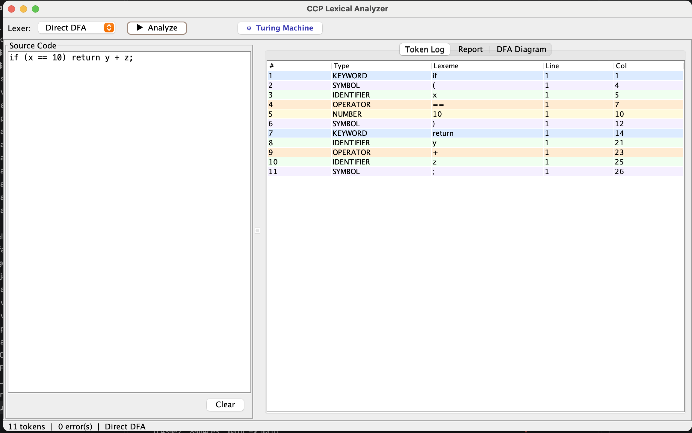
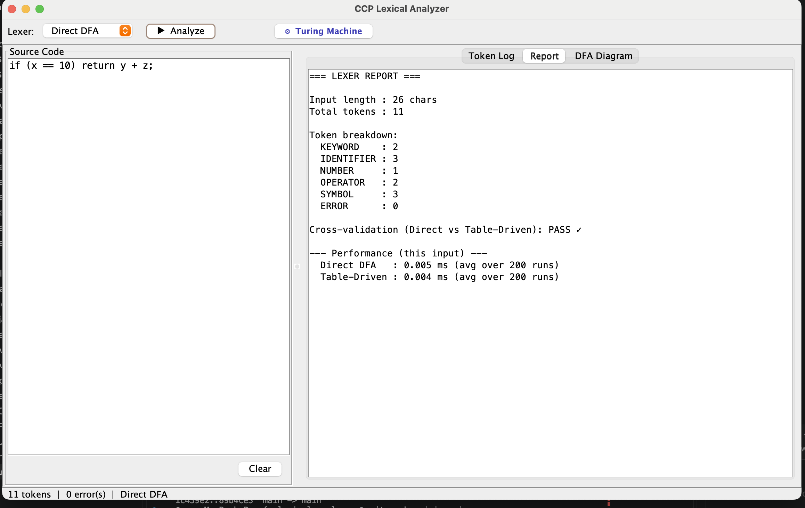
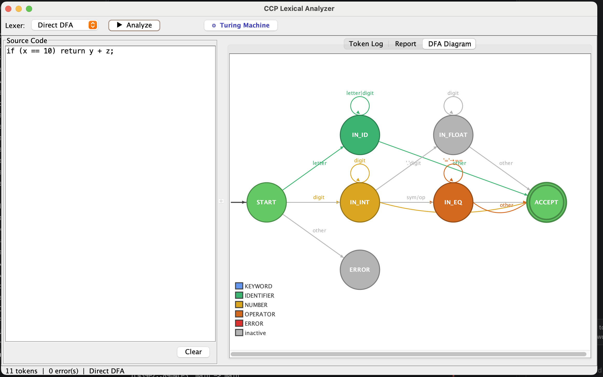
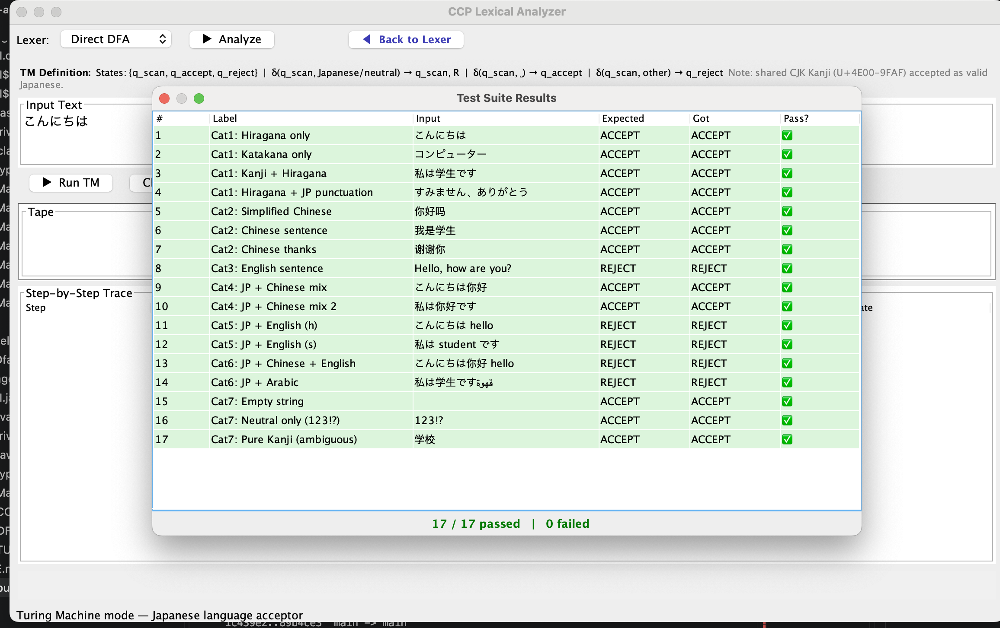

# Lexical Analyzer for a Mini Programming Language

Java (JDK 17+) implementation of the CCP lexical analyzer for the Theory of Automata assignment
(FEST, BS Computer Science). Built two different ways — Direct DFA and Table-Driven DFA — so the
two approaches can be compared directly, as required by the report.

---

## Screenshots

### DFA Lexer — Token Log


### DFA Lexer — Report Tab


### DFA Lexer — DFA Diagram


### Turing Machine Mode


---

## Files

| File | Purpose |
|------|---------|
| `src/TokenType.java` | Token category enum (KEYWORD, IDENTIFIER, OPERATOR, NUMBER, SYMBOL, ERROR) |
| `src/Token.java` | Immutable token record — type, lexeme, line, column |
| `src/LanguageSpec.java` | Single source of truth for keywords, operators, and symbols |
| `src/DirectDfaLexer.java` | Approach 1: hand-coded / direct DFA |
| `src/TableDrivenLexer.java` | Approach 2: table-driven DFA |
| `src/Main.java` | CLI entry point — worked example, 27-case regression suite, performance benchmark, file input |
| `src/LexerUI.java` | Swing GUI — code editor, token log, report tab, DFA diagram |
| `src/DfaPanel.java` | Graphics2D DFA state diagram (used by LexerUI) |
| `src/TuringMachinePanel.java` | Turing Machine mode — Japanese language acceptor with tape visualization |
| `run.sh` | One-command build + run script |
| `run_output.txt` | Captured output of a full CLI run (used for the report's Results section) |
| `GUIDE_DFA_LEXER.md` | Full DFA code explanation + viva Q&A |
| `GUIDE_TURING_MACHINE.md` | Full TM code explanation + viva Q&A |
| `GUIDE_CODE_ARCHITECTURE.md` | How the entire codebase is structured and built |

---

## Build

```bash
cd src
javac -d ../out *.java
```

Requires JDK 17+. On macOS with Homebrew:
```bash
brew install openjdk@17
echo 'export PATH="/usr/local/opt/openjdk@17/bin:$PATH"' >> ~/.zprofile
# open a new terminal, then build
```

---

## Run

### Quickest way (one command)
```bash
./run.sh
```

### GUI (manual)
```bash
cd out
java LexerUI
```

Opens a window with:
- Code editor (left) — type or paste any source code
- Token Log tab — color-coded token table (line + column included)
- Report tab — token breakdown, cross-validation (Direct vs Table-Driven), per-run performance
- DFA Diagram tab — live state diagram highlighting active states for the current input
- **Turing Machine button** (top bar) — switches to TM mode (Japanese language acceptor)

### CLI
```bash
cd out
java Main                      # worked example + 27 regression tests + benchmark
java Main interactive          # REPL: type code line by line, 'quit' to exit
java Main path/to/file.txt     # tokenize a source file
```

---

## What it recognizes

| Category | Rule |
|----------|------|
| KEYWORD | `if` `else` `while` `return` |
| IDENTIFIER | letter (letter\|digit)* |
| OPERATOR | `+` `-` `*` `/` `=` `==` |
| NUMBER | digit+ (`'.'` digit+)? |
| SYMBOL | `(` `)` `{` `}` `;` |
| ERROR | anything else — reported with line/col, never silently dropped |

---

## Example

**Input:** `if (x == 10) return y + z;`

**Output:**
```
[KEYWORD: if]
[SYMBOL: (]
[IDENTIFIER: x]
[OPERATOR: ==]
[NUMBER: 10]
[SYMBOL: )]
[KEYWORD: return]
[IDENTIFIER: y]
[OPERATOR: +]
[IDENTIFIER: z]
[SYMBOL: ;]
```

---

## Turing Machine Mode

Click **⚙ Turing Machine** in the top bar to switch modes.

The TM checks whether input text is written entirely in Japanese.

**Formal definition:**
- States: `q_scan` (start), `q_accept`, `q_reject`
- δ(q_scan, Japanese/neutral) → q_scan, move RIGHT
- δ(q_scan, ␣) → q_accept, HALT
- δ(q_scan, other) → q_reject, HALT

**Accepted character ranges:**

| Range | Unicode | Script |
|-------|---------|--------|
| Hiragana | U+3040–U+309F | あいうえお |
| Katakana | U+30A0–U+30FF | アイウエオ |
| Kanji | U+4E00–U+9FAF | 日本語 (shared with Chinese) |
| JP Punctuation | U+3000–U+303F | 。、「」 |
| Full-width | U+FF00–U+FFEF | Ａ１ |
| Neutral | whitespace, digits, .,!?;() | always allowed |

**Test cases (click 🧪 Run All Tests):**

| Category | Input | Expected |
|----------|-------|----------|
| Hiragana only | `こんにちは` | ACCEPT |
| Katakana only | `コンピューター` | ACCEPT |
| Kanji + Hiragana | `私は学生です` | ACCEPT |
| English | `Hello, how are you?` | REJECT at 'H' |
| JP + English | `こんにちは hello` | REJECT at 'h' |
| JP + Arabic | `私は学生ですقهوة` | REJECT at 'ق' |
| Empty string | `` | ACCEPT (vacuously true) |
| Neutral only | `123!?` | ACCEPT |

---

## CCP Requirements Checklist

| Requirement | Fulfilled |
|-------------|-----------|
| Keywords: if, else, while, return | ✅ |
| Identifiers: letter (letter\|digit)* | ✅ |
| Operators: + - * / = == | ✅ |
| Numbers: integers and floats | ✅ |
| Special characters: ( ) ; { } | ✅ |
| Token stream in order of appearance | ✅ |
| Input as single string | ✅ |
| Input from file | ✅ `java Main file.txt` |
| Finite automaton for token recognition | ✅ Direct DFA + Table-Driven DFA |
| Implementation in a programming language | ✅ Java 17 |
| Testing with various inputs | ✅ 27 regression cases, all passing |
| Performance analysis for different input sizes | ✅ 100 / 1K / 10K / 100K statements |
| Two approaches compared (report requirement) | ✅ DirectDfaLexer vs TableDrivenLexer |

---

## Test Results

All 27 regression cases pass on both implementations (see `run_output.txt`).

Benchmark (best of 7 runs, JIT warmed up):

| Statements | Tokens | Direct DFA | Table-Driven |
|------------|--------|------------|--------------|
| 100 | 825 | ~0.4 ms | ~0.4 ms |
| 1,000 | 8,250 | ~1.9 ms | ~2.8 ms |
| 10,000 | 82,500 | ~3.3 ms | ~5.5 ms |
| 100,000 | 825,000 | ~32 ms | ~35 ms |

Direct DFA is consistently faster due to no table-lookup indirection.

---

## Guides

| File | Contents |
|------|----------|
| `GUIDE_DFA_LEXER.md` | DFA theory, code walkthrough, all 27 edge cases, 15 viva Q&As |
| `GUIDE_TURING_MACHINE.md` | TM formal definition, code walkthrough, test categories, 20 viva Q&As |
| `GUIDE_CODE_ARCHITECTURE.md` | Project structure, dependency graph, design patterns, 10 viva Q&As |
